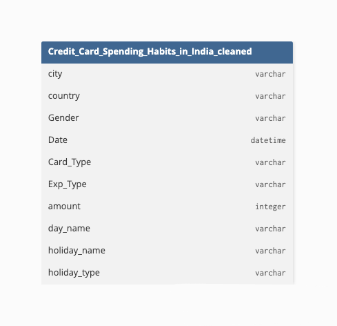
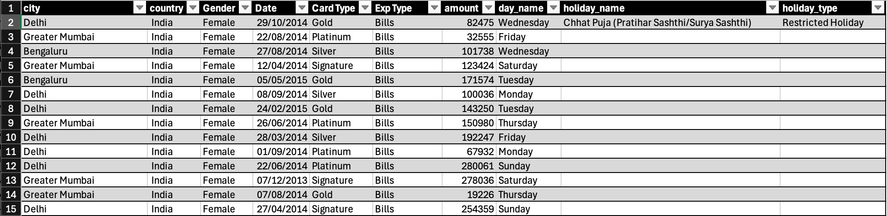
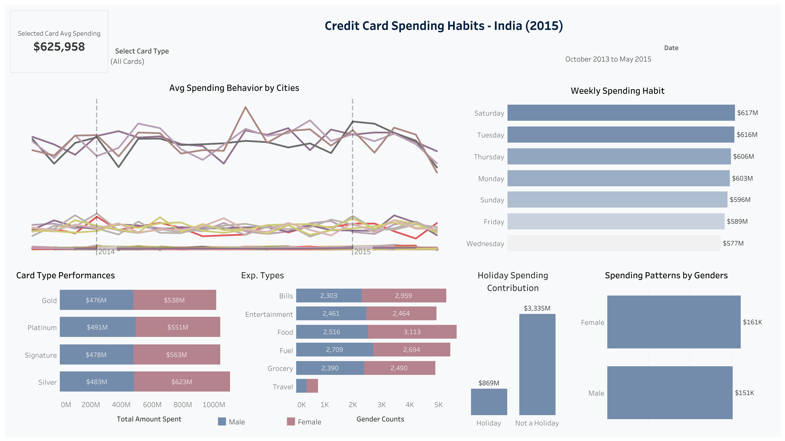
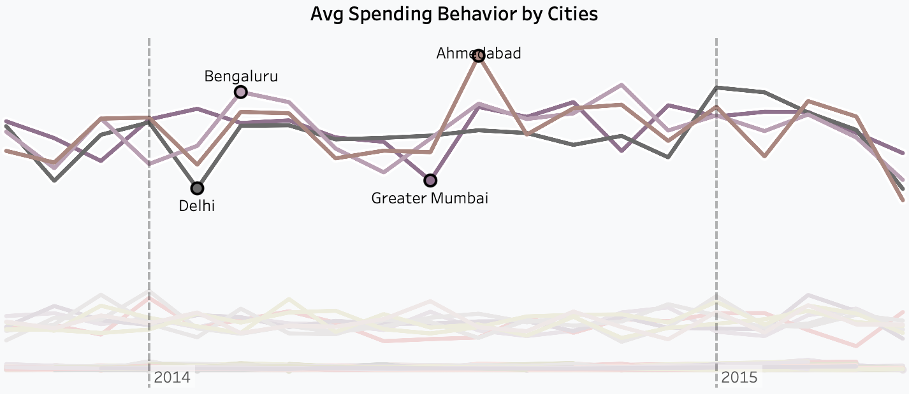
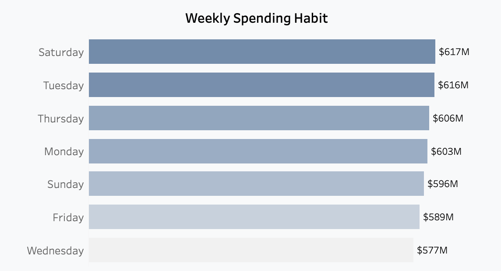
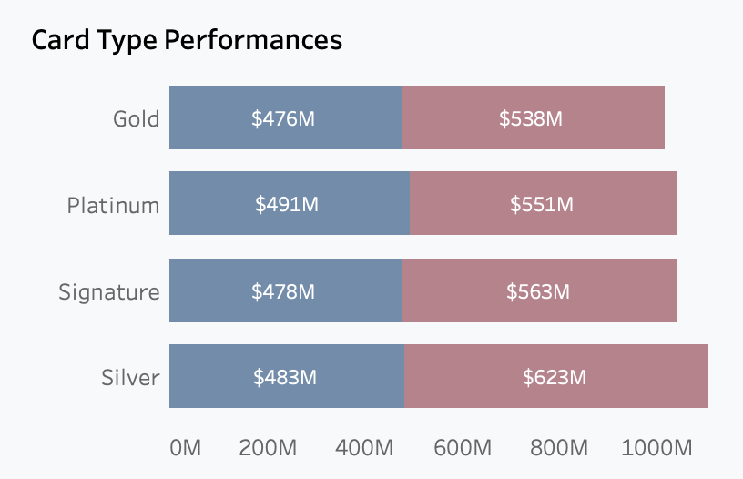
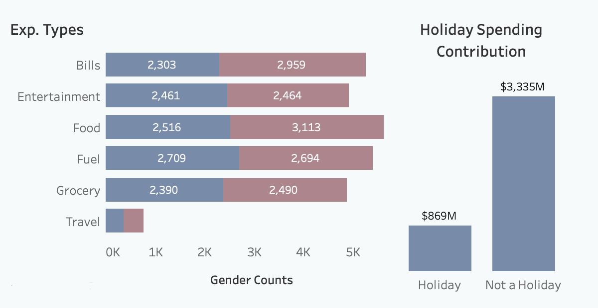

# Credit Card Spending Habits in India

## Table of content
- [Project Background](#project-background)
- [Data Structure](#data-structure)
  - [Repo Structure](#repo-structure)
- [Executive Summary](#executive-summary)

- [Insights Deep Dive](#insights-deep-dive)
- [Avg. spending behaviours by Cities](#)
- [Weekly spending habits](#)
- [Card type Performance](#)
- [Expenses Transaction Analysis](#)


- [Recommendations](#recommendations)
- [Assumptions and Caveats](#assumptions-and-caveats)

## **Project Background**
This dataset contains detailed records of **credit card transactions** across major Indian cities during the 2013–2016 period. It is intended for the analysis of consumer spending behavior, transaction patterns, and usage trends across different cities, card types, and types of expenses. The ultimate goal of this project is to leverage data insights to understand trends and inform strategic decisions for financial institutions and businesses. The dataset provides comprehensive information on spending amounts, frequency, transaction categories, and demographics, enabling a holistic analysis of customer habits and financial engagement across India. This project thoroughly examines and synthesizes the data to uncover key insights that can support banks, service providers, and analysts in identifying opportunities for growth, targeted marketing, and customer engagement strategies.

Insights and Recommendations are provided for the following areas:

- **Average Spending Behavior by Cities:** Identifies which cities show the strongest growth or fluctuations in credit card usage and what those trends imply about local consumer confidence and engagement.

- **Weekly Spending Habits:** Examines how “Spending” varies across days of the week and highlights the most active and least active days for credit card use.

- **Card Type Performance:** Analyzes total and gender-based spending by Card-Category (Silver, Gold, Platinum, Signature) to identify high-performing and underperforming segments.

- **Expense Transaction Analysis:** Investigates which spending categories (e.g., Food, Fuel, Bills, Travel) dominate transaction volumes and how holiday periods influence overall behavior.

_An interactive **Tableau Dashboard** can be used [here](https://public.tableau.com/app/profile/omer.ab1308/viz/CreditCardSpendingHabitsinIndia_17609041788720/Dashboard1).
The **SQL Queries** used to clean, organize and prepare the data can be found [here](https://github.com/omer3bd/Credit_Card_Spending_Habits_India_2013_to_2015/blob/master/credit_card_transactions.sql).
The **web-scraping script** used to extract data from a [website](https://www.timeanddate.com/holidays/india/2013) can be found [here](https://github.com/omer3bd/Credit_Card_Spending_Habits_India_2013_to_2015/blob/master/scraping_indian_holidays.py)._

## **Data Structure**





The **Credit Card Spending Habits** dataset as seen above consists of **one table**: city, country, gender, date, card type, expense hype, amount, day name, holiday name, holiday type with a **total row count of 26,862 records.**

### **Repo Structure**
```plaintext
Credit Card Spending Habits in India/
│
├──── web_scraping exports/	  # web scraped files
│     ├── indian_holidays_2013.csv
│     ├── indian_holidays_2014.csv
│     └── indian_holidays_2015.csv
│
├──── images/	# imagoes used for markdown file
│     ├── Dashboard.png
│     ├── 1.avg_spending_behaviours_by_cities.png
│     ├── 2.weekly_spending_habits.png
│     ├── 3.card_type_performances.png
│     ├── 4.exp_type_and_holiday_spending_contribution.png
│     ├── ERD.png
│     └── Dataset_Screenshot.png
│
├── RAW_Credit_card_transactions - India - Simple.zip	 # Raw data
├── link.txt	 # link to kaggle
├── scraping_indian_holidays.py
├── Credit Card Spending Habits in India_cleaned.csv
├── Credit Card Spending Habits in India.twbx		 # Dashboard workbook
├── Credit Card Spending Habits in India.pdf
└── README.md
```

## Executive Summary

### _Overview of Findings:_

The analysis of **Credit Card spending patterns** across major Indian cities (2014–2015) reveals distinct behavioral trends among consumers. **Ahmedabad experienced the most significant surge** in credit card usage, indicating strong economic engagement, while **Delhi and Greater Mumbai showed stable spending patterns** with minor temporary declines.

In terms of weekly spending habits, **Saturday recorded the highest expenditure at \$617 million**, driven largely **by leisure and retail purchases.** Weekday spending remained steady, with Tuesday and Thursday showing strong performance and Wednesday reflecting the lowest activity at $577 million.

Analysis of card type performance shows the **Silver Card as the most utilized**, generating approximately **\$1.6 billion in total spending**. The Gold Card exhibited the lowest spending volume at $1.01 billion.

Finally, the **Expenses Transaction** analysis highlights **Food, Fuel, and Bills** as the leading categories in **transaction volume**, representing essential and recurring expenditures. The Travel category recorded minimal transactions.



Below is the page from tableau dashboard and more examples are included throughout the report. The entire interactive dashboard can be used [here](https://public.tableau.com/app/profile/omer.ab1308/viz/CreditCardSpendingHabitsinIndia_17609041788720/Dashboard1).

## Insights Deep Dive

### Avg. spending behaviours by Cities:
- During the period of 2014–2015, **Ahmedabad** recorded the **most significant surge in credit card spending** compared to other major cities across India, indicating a strong rise in consumer activity and financial engagement.


- **Delhi** and **Greater Mumbai** demonstrated **steady and stable performance** throughout most of the period. However, both cities experienced a **temporary decline in spending** before gradually returning to their usual levels of performance, suggesting a short-term fluctuation rather than a sustained downturn.


- **Bengaluru**, on the other hand, showed **consistent spending behavior** without any sharp declines. Despite this stability, the city’s overall growth in credit card spending remained moderate, indicating steady but unspectacular progress.



### Weekly spending habits:
- An analysis of weekly credit card usage patterns indicates that **Saturday recorded the highest total spending, reaching $617 million**, suggesting that consumers are most active during weekends; likely due to leisure activities, dining, and retail purchases.


- Conversely, **Wednesday** showed the **lowest spending volume, amounting to $577 million**, reflecting a midweek lull in consumer expenditure.


- Notably, **Tuesday** and **Thursday** also demonstrated **strong spending activity, with totals of $616 million and \$606 million**, respectively. This pattern highlights that spending behavior remains relatively stable during the weekdays, with only a modest dip midweek.



### Card type Performance:

- The **Silver Card-category recorded the highest total spending**, making it the most utilized card type during the analysis period. Male customers accounted for \$483 million, while female customers exceeded that figure with \$623 million, bringing the **total spending to approximately \$1.6 billion**.


- In contrast, the **Gold Card type reflected the lowest overall spending**, with male customers contributing \$476 million and female customers \$538 million, resulting in **a combined total of \$1.01 billion.**


- **The Platinum and Signature card types displayed comparable spending patterns**, with male customers spending \$491 million and \$478 million, and female customers spending \$551 million and \$563 million, respectively. **This indicates a balanced distribution of spending between the two premium Card-categories.**



### Expenses Transaction Analysis:

- Among all expense categories, **Food and Fuel recorded the highest number of transactions, with 5,629 and 5,403 transactions respectively**. These categories indicate strong and consistent consumer engagement in essential, day-to-day spending.


- In contrast, the **Travel category recorded the lowest transaction volume, with only 780 transactions**, suggesting either limited travel activity during the analyzed period or a preference for alternative payment methods in that category.


- The **Bills category also emerged as a significant contributor, accounting for 5,262 transactions**, reflecting regular payment behavior tied to recurring necessities.


- Furthermore, **a noticeable behavioral shift is observed when comparing spending patterns during holidays versus non-holiday periods**, with customers demonstrating distinct preferences and spending frequencies outside the holiday season.



## Recommmendations

- **Monitor Stability Factors in Delhi and Mumbai** Examine the causes of the temporary dip to prevent similar fluctuations in the future.


- The Silver Card’s success suggests strong customer engagement; banks could **introduce loyalty rewards or exclusive benefits to retain these high-value users**.


- **Enhance Gold Card Appeal**, revising reward structures or lowering annual fees may help boost its adoption.


- **Focus on Essential Spending Segments** by strengthening partnerships with Food and Fuel merchants to introduce cashback or discount programs that reward frequent spending.


- **Develop seasonal promotions or travel reward campaigns** to encourage greater card usage in this category.


- **Leverage Bill Payments for Retention** by offering automated bill payment features or bonus points to improve customer convenience and loyalty.


- **Introduce limited-time offers or credit card discounts on Wednesdays** to counteract the midweek spending slowdown and maintain consistent transaction activity.

## Assumptions and Caveats

**Assumptions:**
- The dataset accurately reflects all credit card transactions across the selected cities during 2014-15.


- Spending patterns observed in the dataset are representative of general consumer behavior for the respective cities, card types, and expense categories.


- Transaction categorization (e.g. Food, Fuel, Travel, Bills) is consistent and correctly labeled throughout the dataset.

**Caveats:**
- The dataset may not capture all transactions (e.g. cash payments, online wallets, or card usage outside the recorded network), which could affect overall spending insights.


- External economic or regional events (e.g. festivals, strikes, fuel price changes) could have caused atypical spending surges or dips that are not separately accounted for.


- Comparisons across cities, card types, or expense categories assume similar reporting standards and do not account for local variations in card adoption or merchant participation.
